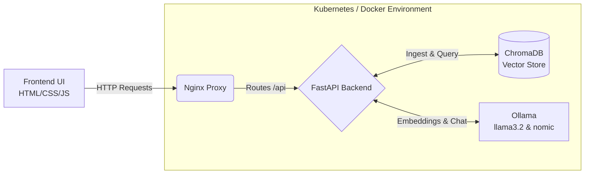
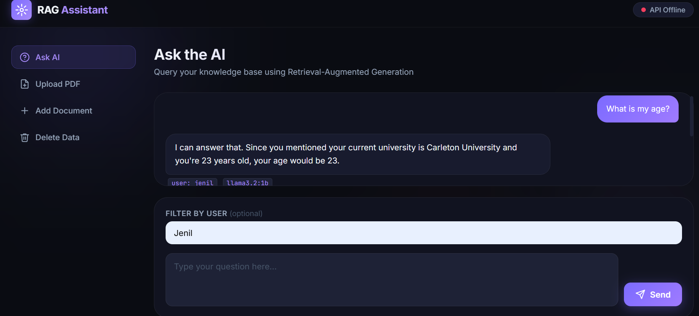
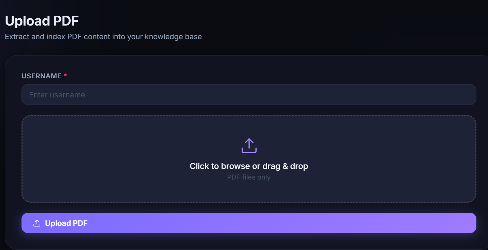

# 🚀 RAG API: Intelligent Document Querying with Local LLMs

<div align="center">
  
  
  
  
  
</div>

<br/>

An end-to-end **Retrieval-Augmented Generation (RAG)** application built from scratch to allow users to securely upload documents, PDFs, and personal profiles, and instantly chat with their data using **completely local, privacy-first LLMs** via Ollama. 

Designed with a sleek, responsive frontend and a highly scalable backend, this project is fully containerized and Kubernetes-ready.

---

## ✨ Features

- **Privacy First (100% Local)**: Powered by local LLMs (`llama3.2:1b`) and local embeddings (`nomic-embed-text`) using Ollama. No data ever leaves your network.
- **Context-Aware AI**: The AI answers questions *exclusively* using the documents you provide. If it doesn't know, it won't hallucinate.
- **Multi-Format Ingestion**: Upload standard text or complex PDF documents.
- **User Segregation**: Document indexing is user-specific. You can filter AI queries to rely only on a specific user's uploaded knowledge base.
- **Sleek Vanilla Frontend**: A beautiful, responsive interface built with pure HTML/CSS/JS—no bulky frameworks, styled with modern glassmorphism and dynamic interactions.
- **Enterprise Ready**: Comes fully equipped with `docker-compose` for rapid deployment and a complete `deployment.yml` for Kubernetes orchestration.

## 🏗️ Architecture



## 🛠️ Tech Stack

- **Backend**: Python, FastAPI, PyPDF2
- **AI & ML**: Ollama (`llama3.2:1b`, `nomic-embed-text`)
- **Vector Database**: ChromaDB
- **Frontend**: Vanilla HTML5, CSS3 (Custom Glassmorphic Design), Vanilla JavaScript
- **DevOps**: Docker, Docker Compose, Kubernetes (Minikube), Nginx

---

## 🚀 Deployment Guide

Choose your preferred deployment method below.

### Option 1: Kubernetes (Recommended for Production/Scale)

**Prerequisites:** [Minikube](https://minikube.sigs.k8s.io/docs/start/) and `kubectl` installed.

1. **Start Minikube & Configure Docker Env:**
   ```bash
   minikube start
   # Point your terminal's docker CLI to the Minikube cluster
   eval $(minikube docker-env)  # (Mac/Linux)
   & minikube -p minikube docker-env | Invoke-Expression # (Windows PowerShell)
   ```

2. **Build the Images Locally (inside Minikube):**
   ```bash
   docker build -t rag-api-project-app:latest .
   docker build -t rag-api-project-frontend:latest ./frontend
   ```

3. **Deploy to Kubernetes:**
   ```bash
   kubectl apply -f deployment.yml
   ```

4. **Verify & Access:**
   ```bash
   # Wait for all pods to be 1/1 Running
   kubectl get pods

   # Start the frontend service tunnel
   minikube service rag-frontend-service --url
   ```
   > **Note:** If you are using Windows with the Docker driver, open a new terminal and run `kubectl port-forward svc/rag-api-service 8000:8000` to ensure local API routing works flawlessly with the frontend.

### Option 2: Docker Compose (Recommended for Quick Start)

**Prerequisites:** Docker & Docker Compose installed.

1. **Spin up the stack:**
   ```bash
   docker-compose up -d --build
   ```
2. **Access the Application:**
   - Frontend UI: `http://localhost:3000`
   - FastAPI Docs: `http://localhost:8000/docs`

### Option 3: Local Development (Without Docker)

1. **Start Ollama** and pull the required models:
   ```bash
   ollama serve
   ollama pull llama3.2:1b
   ollama pull nomic-embed-text
   ```
2. **Install Python dependencies:**
   ```bash
   pip install -r requirements.txt
   ```
3. **Run the FastAPI Backend:**
   ```bash
   uvicorn main:app --reload --host 0.0.0.0 --port 8000
   ```
4. **Run the Frontend:**
   Use VS Code Live Server to open `frontend/index.html` (runs on port 5500).

---

## 📡 API Endpoints

The backend is fully documented with Swagger UI. When running, navigate to `/docs` to interact directly with the API.

| Method | Endpoint | Description |
|--------|----------|-------------|
| `GET` | `/ask` | Query the LLM. Parameters: `question` (required), `user` (optional) |
| `POST` | `/upload-pdf` | Upload a PDF to ingest into the vector database for a specific user |
| `POST` | `/user_documents` | Submit raw text as knowledge context for a specific user |
| `DELETE` | `/user_documents/{username}`| Purge all indexed knowledge for a specific user |

---

## 📸 Interface Sneak Peek

<details>
<summary>Click to view screenshots!</summary>
<br>

### 🤖 Chat with AI


<br>

### 📄 Upload Documents


</details>

---

<div align="center">
  <i>Built with ❤️ by Jenil</i>
</div>
